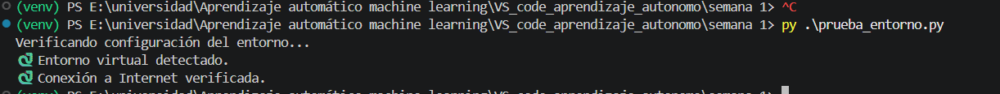
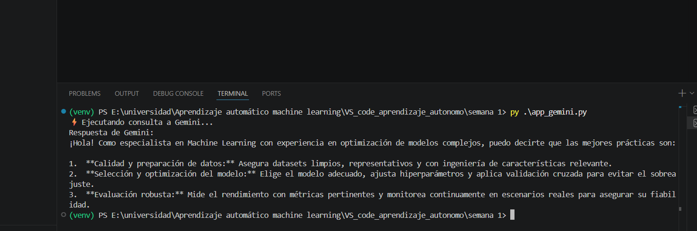

# Semana 1 — Aprendizaje Automático (Machine Learning)

Scripts de la primera semana del curso de aprendizaje autónomo de Machine Learning.
Incluye un verificador del entorno y un ejemplo de conexión a la API de Google Gemini.

## Archivos

- **`prueba_entorno.py`** — Verifica la configuración del entorno: detecta si se está usando un entorno virtual y comprueba la conexión a Internet.
- **`app_gemini.py`** — Ejemplo de conexión y consulta a la API de Google Gemini (`gemini-2.5-flash`) usando una clave guardada en variables de entorno.

## Requisitos

- Python 3.10 o superior
- Una clave de API de Google Gemini ([obtener aquí](https://aistudio.google.com/app/apikey))

Instalar las dependencias:

```bash
pip install google-genai python-dotenv requests
```

## Configuración

`app_gemini.py` lee la clave de la API desde un archivo `.env` (no incluido en el repositorio por seguridad). Crea un archivo `.env` en la raíz del proyecto con el siguiente contenido:

```env
GEMINI_API_KEY=tu_clave_aqui
```

## Cómo ejecutar el código

1. (Opcional pero recomendado) Crea y activa un entorno virtual:

   ```bash
   python -m venv venv
   # Windows
   venv\Scripts\activate
   # Linux / macOS
   source venv/bin/activate
   ```

2. Instala las dependencias (ver sección anterior).

3. Verifica que el entorno esté bien configurado:

   ```bash
   python prueba_entorno.py
   ```

4. Ejecuta la conexión a la API de Gemini:

   ```bash
   python app_gemini.py
   ```

## Evidencia de ejecución

### Verificación del entorno (`prueba_entorno.py`)



### Conexión a la API de Gemini (`app_gemini.py`)


